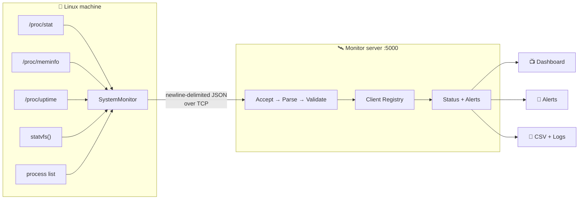
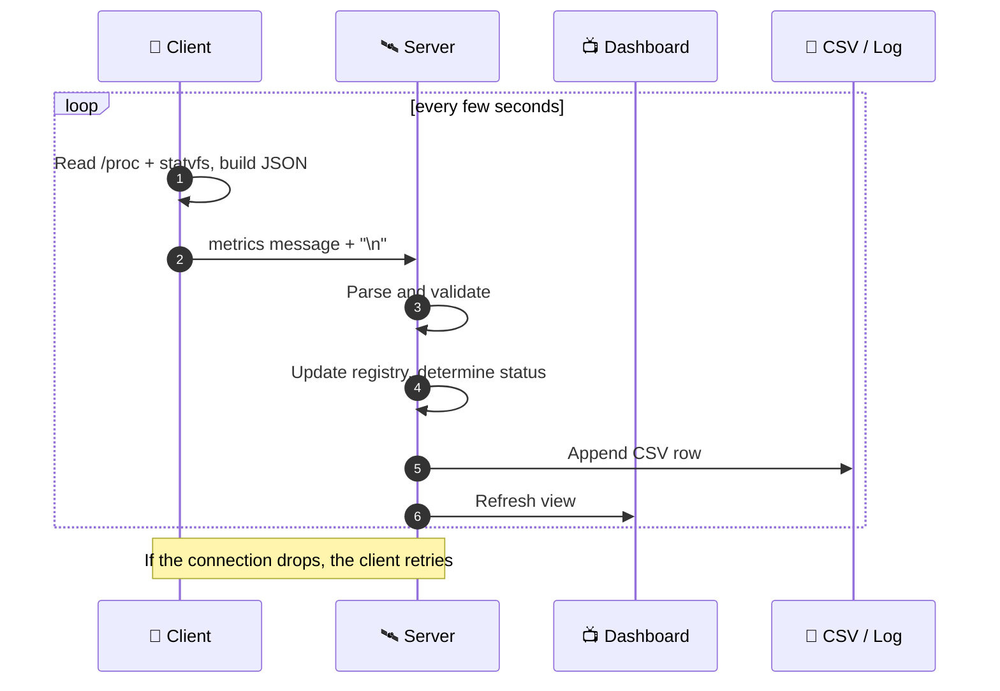
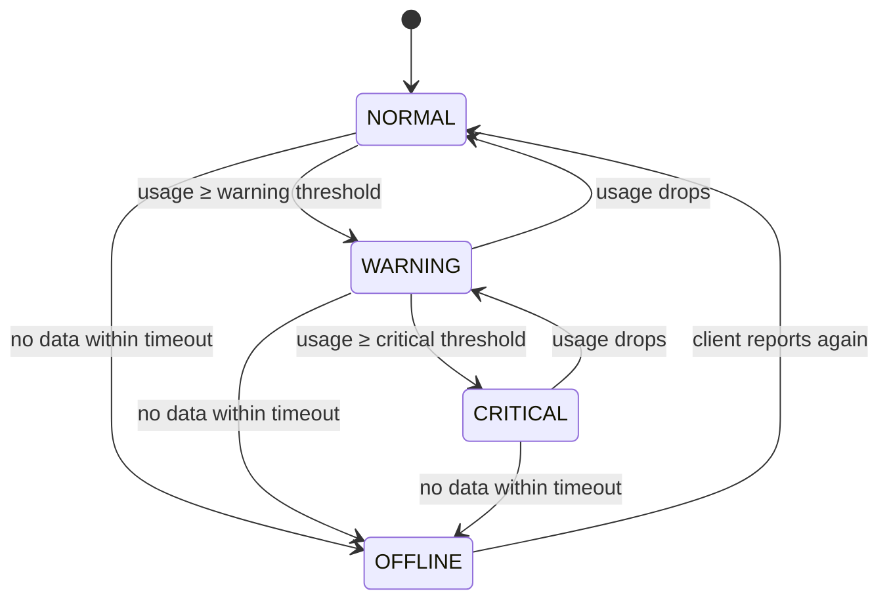

<div align="center">


<a href="https://git.io/typing-svg">

</a>

<br/>


**[The Idea](#-the-idea)** · **[Features](#-features)** · **[Quick Start](#-quick-start)** · **[How It Works](#-how-it-works)** · **[Protocol](#-wire-protocol)** · **[Testing](#-testing)** · **[Structure](#-project-structure)**

</div>

---

```text
  ██╗     ██╗███╗   ██╗██╗   ██╗██╗  ██╗    ███╗   ███╗ ██████╗ ███╗   ██╗
  ██║     ██║████╗  ██║██║   ██║╚██╗██╔╝    ████╗ ████║██╔═══██╗████╗  ██║
  ██║     ██║██╔██╗ ██║██║   ██║ ╚███╔╝     ██╔████╔██║██║   ██║██╔██╗ ██║
  ██║     ██║██║╚██╗██║██║   ██║ ██╔██╗     ██║╚██╔╝██║██║   ██║██║╚██╗██║
  ███████╗██║██║ ╚████║╚██████╔╝██╔╝ ██╗    ██║ ╚═╝ ██║╚██████╔╝██║ ╚████║
  ╚══════╝╚═╝╚═╝  ╚═══╝ ╚═════╝ ╚═╝  ╚═╝    ╚═╝     ╚═╝ ╚═════╝ ╚═╝  ╚═══╝
              ▸ mission control for every Linux box you own ◂
```

## 🎬 The Idea

Most monitoring tools hide how they work behind a framework. This project does the opposite. It talks to the Linux kernel directly, builds its own wire protocol on top of raw TCP sockets, and keeps track of every machine that reports in, all in plain C++17.



---

## ⚡ At a Glance

<div align="center">

| 🧠 Language | 🐧 Platform | 🔌 Transport | 📦 Wire Format |
|:---:|:---:|:---:|:---:|
| **C++17** | **Linux** (Ubuntu) | **POSIX TCP** · port `5000` | **Newline-delimited JSON** |

| 📊 Metrics | 🚦 States | 💾 Persistence | 🧪 Tests |
|:---:|:---:|:---:|:---:|
| CPU · RAM · Disk · Procs · Uptime · Host · Kernel | `NORMAL` `WARNING` `CRITICAL` `OFFLINE` | `metrics.csv` + `server.log` | `make test` + manual integration |

</div>

---

## ✨ Features

<table>
<tr>
<td width="33%" valign="top" align="center">

### 📡
**Live Metrics**

CPU, memory, disk, processes, uptime, hostname and kernel, read straight from `/proc` and POSIX APIs.

</td>
<td width="33%" valign="top" align="center">

### 🆔
**Persistent Identity**

Every machine gets a stable ID like `PC-945742`, so the server always knows who is reporting.

</td>
<td width="33%" valign="top" align="center">

### 🔄
**Self-Healing Client**

If the server vanishes, the client retries and resumes automatically when it returns.

</td>
</tr>
<tr>
<td width="33%" valign="top" align="center">

### 📺
**Live Dashboard**

A refreshing terminal table of every client. Copy-friendly, no GUI needed.

</td>
<td width="33%" valign="top" align="center">

### 🚦
**Smart Status**

CPU, memory and disk thresholds give `NORMAL`, `WARNING` or `CRITICAL`. Silent clients go `OFFLINE`.

</td>
<td width="33%" valign="top" align="center">

### 🛑
**Graceful Shutdown**

`Ctrl+C` stops accepting clients and exits cleanly instead of dying mid-write.

</td>
</tr>
</table>

---

## 📺 Dashboard Preview

```text
╔══════════════════════════════════════════════════════════════════════════╗
║                          LINUX SYSTEM MONITOR                            ║
╚══════════════════════════════════════════════════════════════════════════╝

Client ID      Hostname       CPU %     Memory %    Disk %    Processes   Status
--------------------------------------------------------------------------
PC-945742      Ubuntu         24.2      70.7        34.1      310         WARNING

--------------------------------------------------------------------------
Total Clients: 1
Dashboard refresh interval: 2 seconds
```

---

## 🚀 Quick Start

> [!TIP]
> You only need a Linux machine, `g++` and `make`. Everything runs locally on `127.0.0.1:5000` by default.

**① Install dependencies**

```bash
sudo apt update
sudo apt install build-essential nlohmann-json3-dev netcat-openbsd
```

**② Clone and build**

```bash
git clone <your-repository-url>
cd linux-system-monitor
make
```

**③ Launch** (two terminals)

```bash
# Terminal 1: the server
./build/server

# Terminal 2: a client
./build/client
```

Switch back to Terminal 1 and watch your machine appear on the dashboard. 🎉

<details>
<summary><b>🔧 More build commands</b></summary>

<br/>

```bash
make client      # build the client only
make server      # build the server only
make clean       # remove build artifacts
make test        # build and run automated tests
```

</details>

---

## 🔬 How It Works

### 🔁 One monitoring cycle



### 🧮 Design decisions worth knowing

| 💡 Decision | 🎯 Why |
|---|---|
| **CPU % uses two samples** of `/proc/stat` | The counters are cumulative, so one read can't give a real percentage. Usage is `(Δtotal − Δidle) / Δtotal × 100`. |
| **Memory uses `MemAvailable`, not `MemFree`** | `MemFree` ignores reclaimable cache and makes healthy machines look nearly full. |
| **Newline-delimited JSON** | TCP is a byte stream with no message boundaries. A trailing `\n` gives simple, reliable framing. |
| **Server never trusts input** | Every message is parsed and range-checked before it touches client state. |
| **Heartbeat timeout** | A client silent for about 15 seconds is marked `OFFLINE`. |

---

## 📦 Wire Protocol

Each message is a single JSON object followed by `\n`.

```json
{
    "type": "metrics",
    "client_id": "PC-945742",
    "hostname": "Ubuntu",
    "kernel_version": "7.0.0-38-generic",
    "cpu_usage": 3.53,
    "memory_usage": 70.68,
    "disk_usage": 34.09,
    "process_count": 310,
    "uptime_seconds": 5996.45,
    "timestamp": 1791042240
}
```

### 🛡️ Input validation

The server rejects bad data instead of crashing on it.

| Case | Result |
|---|---|
| Missing fields | ❌ Rejected |
| Malformed JSON | ❌ Rejected |
| Invalid metric values | ❌ Rejected |
| Out-of-range values, e.g. `"cpu_usage": 500` | ❌ Rejected |
| Invalid client messages | ❌ Rejected |

---

## 🚦 Status Logic



| Status | Meaning |
|:---:|---|
| 🟢 **NORMAL** | Below the warning threshold |
| 🟡 **WARNING** | At or above the warning threshold |
| 🔴 **CRITICAL** | At or above the critical threshold |
| ⚫ **OFFLINE** | No data received within the heartbeat timeout |

The same rule applies to CPU, memory and disk. The `AlertManager` tracks state transitions, so changes in condition are recognised, not just snapshots.

---

## 💾 Persistence

| 📄 File | 📝 Contents |
|---|---|
| `logs/metrics.csv` | Historical metrics, one row per sample |
| `logs/server.log` | Server events (connections, disconnects, errors) |

```text
timestamp,client_id,hostname,kernel_version,cpu_usage,memory_usage,disk_usage,process_count,uptime_seconds
```

---

## 📁 Project Structure

```text
linux-system-monitor/
├── 🟦 client/
│   ├── main.cpp
│   ├── ClientIdentity.{h,cpp}
│   ├── NetworkClient.{h,cpp}
│   └── SystemMonitor.{h,cpp}
├── 🟥 server/
│   ├── main.cpp
│   ├── Server.{h,cpp}
│   ├── ClientRegistry.{h,cpp}
│   ├── ClientState.h
│   ├── AlertManager.{h,cpp}
│   ├── Dashboard.{h,cpp}
│   ├── CsvLogger.{h,cpp}
│   ├── Logger.{h,cpp}
│   └── test_csv.cpp · test_dashboard.cpp · test_logger.cpp
├── 🟩 common/
│   ├── SystemData.h
│   ├── Config.h
│   ├── ConfigLoader.{h,cpp}
│   └── test_config.cpp
├── ⚙️ config/
│   └── config.json
├── 🧪 tests/
│   ├── test_metrics.cpp
│   └── test_protocol.cpp
├── 📜 logs/            # metrics.csv, server.log (generated)
├── 🗂️ data/
├── 📚 docs/
├── 🏗️ build/           # compiled binaries (generated)
├── Makefile
└── README.md
```

---

## ⚙️ Configuration

`config/config.json` holds the server address, port, client intervals, monitoring thresholds and heartbeat settings, and `ConfigLoader` can read it.

> [!NOTE]
> The alert thresholds currently active at runtime are initialised directly in `Server.cpp`. The config file is not yet the source of truth for them.

---

## 🧪 Testing

```bash
make test
```

| 🧫 Test | ✅ Verifies |
|---|---|
| **Metric test** | CPU, memory, disk and process count return sane values |
| **Protocol test** | System data round-trips correctly through the JSON protocol |

```text
CPU Usage: 0.504414%
Memory Usage: 77.6159%
Disk Usage: 34.0944%
Process Count: 312

Metric tests passed!
Protocol test passed!
```

### 🕵️ Also verified manually

| Scenario | |
|---|:---:|
| JSON validation and rejection of bad input | ✅ |
| Alert state transitions | ✅ |
| Client disconnect → `OFFLINE` after the heartbeat timeout | ✅ |
| Client reconnection after server restart | ✅ |
| CSV persistence | ✅ |
| Graceful shutdown | ✅ |
| **Five simultaneous client processes** on concurrent TCP connections | ✅ |

Try the malformed-data test yourself:

```bash
echo "this is not json" | nc localhost 5000
```

The server should reject it and keep running.

---

## 🛠️ Built With

<div align="center">


-Disk-9b5de5?style=flat-square)


</div>

---

## 🎓 What This Project Demonstrates

<div align="center">

`Linux /proc internals` · `C++17` · `POSIX APIs` · `TCP socket programming` · `Client–server architecture`
`Concurrent connections` · `JSON serialization` · `Message framing` · `Input validation` · `State management`
`Logging & CSV persistence` · `Reconnection handling` · `Signal handling` · `Build automation` · `Automated testing`

</div>

---

## 📌 Project Status

```text
╭──────────────────────────────┬──────────────────────────────╮
│ System Metrics          ✅   │ Dashboard               ✅   │
│ TCP Communication       ✅   │ Status Detection        ✅   │
│ JSON Protocol           ✅   │ Alert Management        ✅   │
│ Client Identity         ✅   │ CSV Logging             ✅   │
│ Client Registry         ✅   │ Server Logging          ✅   │
│ Reconnect Handling      ✅   │ Graceful Shutdown       ✅   │
│ Automated Tests         ✅   │ Makefile                ✅   │
╰──────────────────────────────┴──────────────────────────────╯
```

**Current status: Functional.** The core client–server monitoring workflow is implemented and tested.

---

<div align="center">

### 👨‍💻 Author

**Suniyan Jana**
B.Tech, Computer Science & Engineering

*Built as a hands-on deep dive into Linux system programming, C++ networking and monitoring architecture.*

<br/>

⭐ If this project helped or interested you, consider giving it a star!


</div>
