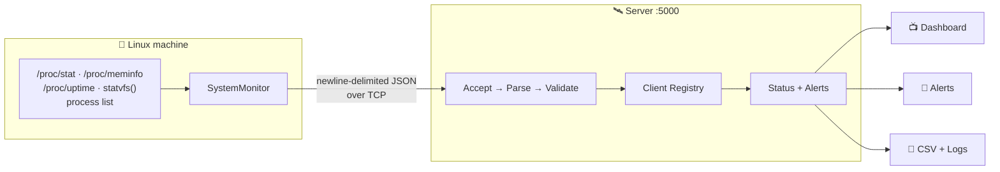
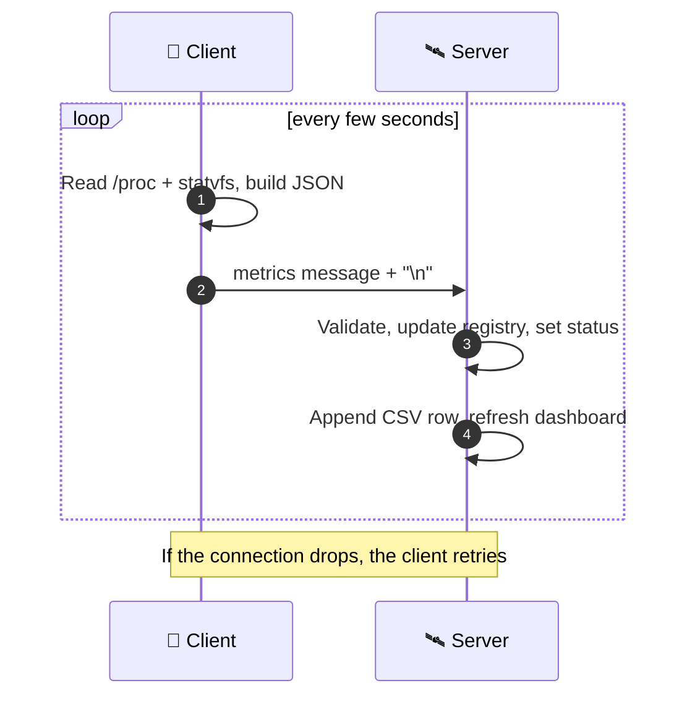
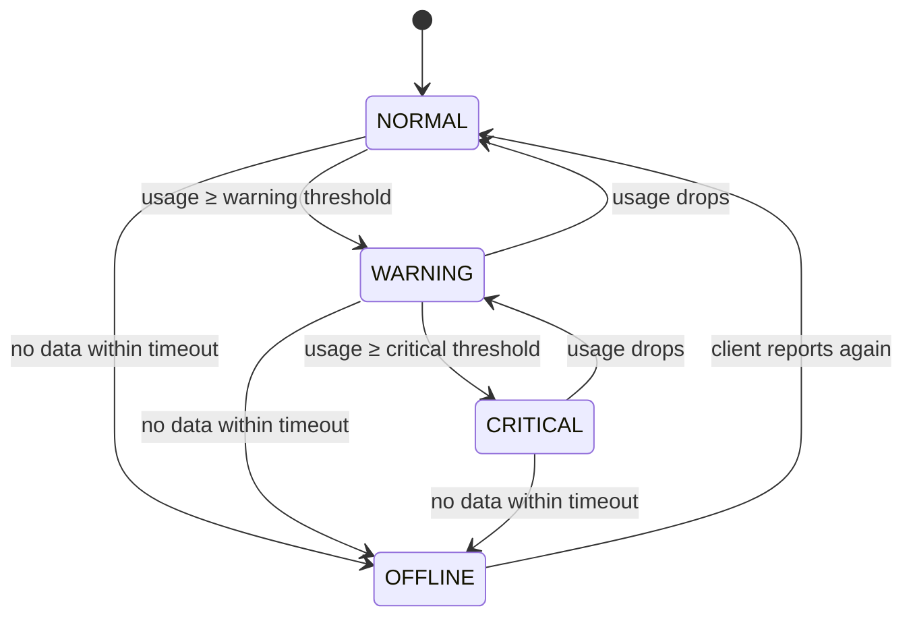

<div align="center">


<a href="https://git.io/typing-svg">

</a>


**[Idea](#-the-idea)** · **[Features](#-features)** · **[Quick Start](#-quick-start)** · **[How It Works](#-how-it-works)** · **[Protocol](#-wire-protocol)** · **[Testing](#-testing)** · **[Structure](#-project-structure)**

</div>

---

## 🎬 The Idea

Most monitoring tools hide their workings behind a framework. This one talks to the Linux kernel directly, builds its own protocol on raw TCP sockets, and tracks every machine that reports in, all in plain C++17.



---

## ✨ Features

| | | |
|:---:|:---:|:---:|
| 📡 **Live Metrics**<br/>CPU, RAM, disk, processes, uptime, hostname, kernel | 🆔 **Persistent Identity**<br/>Stable ID like `PC-945742` per machine | 🔄 **Self-Healing Client**<br/>Retries and resumes if the server drops |
| 📺 **Live Dashboard**<br/>Refreshing terminal table, no GUI | 🚦 **Smart Status**<br/>`NORMAL` `WARNING` `CRITICAL` `OFFLINE` | 🛑 **Graceful Shutdown**<br/>`Ctrl+C` exits cleanly |

```text
Client ID      Hostname       CPU %     Memory %    Disk %    Processes   Status
--------------------------------------------------------------------------
PC-945742      Ubuntu         24.2      70.7        34.1      310         WARNING
Total Clients: 1  |  Dashboard refresh interval: 2 seconds
```

---

## 🚀 Quick Start

> [!TIP]
> Needs a Linux machine with `g++` and `make`. Defaults to `127.0.0.1:5000`.

```bash
sudo apt update && sudo apt install build-essential nlohmann-json3-dev netcat-openbsd
git clone <your-repository-url> && cd linux-system-monitor
make                  # also: make client | make server | make clean | make test

./build/server        # Terminal 1
./build/client        # Terminal 2, then watch the server dashboard 🎉
```

---

## 🔬 How It Works



| 💡 Decision | 🎯 Why |
|---|---|
| **CPU % from two `/proc/stat` samples** | Counters are cumulative: `(Δtotal − Δidle) / Δtotal × 100`. |
| **`MemAvailable`, not `MemFree`** | `MemFree` ignores reclaimable cache and overstates usage. |
| **Newline-delimited JSON** | TCP has no message boundaries; `\n` gives simple framing. |
| **Server never trusts input** | Messages are parsed and range-checked before touching state. |
| **~15 s heartbeat timeout** | A silent client is marked `OFFLINE`. |

---

## 📦 Wire Protocol

One JSON object per line, terminated by `\n`:

```json
{
    "type": "metrics", "client_id": "PC-945742", "hostname": "Ubuntu",
    "kernel_version": "7.0.0-38-generic",
    "cpu_usage": 3.53, "memory_usage": 70.68, "disk_usage": 34.09,
    "process_count": 310, "uptime_seconds": 5996.45, "timestamp": 1791042240
}
```

🛡️ **Rejected, not crashed on:** missing fields · malformed JSON · invalid values · out-of-range values (e.g. `"cpu_usage": 500`) · invalid client messages.

---

## 🚦 Status Logic



The rule applies to CPU, memory and disk, and `AlertManager` tracks state transitions.

---

## 💾 Persistence & Configuration

- `logs/metrics.csv`: one row per sample
  `timestamp,client_id,hostname,kernel_version,cpu_usage,memory_usage,disk_usage,process_count,uptime_seconds`
- `logs/server.log`: connections, disconnects, errors
- `config/config.json`: server address, port, client intervals, thresholds, heartbeat (read by `ConfigLoader`)

> [!NOTE]
> The alert thresholds active at runtime are set directly in `Server.cpp`; the config file is not yet their source of truth.

---

## 🧪 Testing

```bash
make test             # metric test + protocol test
echo "this is not json" | nc localhost 5000    # server should reject it and keep running
```

```text
CPU Usage: 0.504414%  ·  Memory Usage: 77.6159%  ·  Disk Usage: 34.0944%  ·  Process Count: 312
Metric tests passed!   Protocol test passed!
```

✅ **Also verified manually:** JSON validation · alert transitions · disconnect → `OFFLINE` · reconnect after server restart · CSV persistence · graceful shutdown · **five simultaneous client processes**.

---

## 📁 Project Structure

```text
linux-system-monitor/
├── 🟦 client/    main.cpp · ClientIdentity · NetworkClient · SystemMonitor
├── 🟥 server/    main.cpp · Server · ClientRegistry · ClientState.h · AlertManager
│                 Dashboard · CsvLogger · Logger · test_csv/dashboard/logger.cpp
├── 🟩 common/    SystemData.h · Config.h · ConfigLoader · test_config.cpp
├── ⚙️ config/    config.json
├── 🧪 tests/     test_metrics.cpp · test_protocol.cpp
├── 📜 logs/      metrics.csv · server.log (generated)
├── 🗂️ data/ · 📚 docs/ · 🏗️ build/ (binaries, generated)
└── Makefile · README.md
```

---

## 🛠️ Built With & Demonstrates

<div align="center">


-Disk-9b5de5?style=flat-square)


`Linux /proc internals` · `TCP sockets` · `Client–server design` · `Concurrent connections` · `JSON & message framing` · `Input validation` · `Logging & CSV` · `Reconnection` · `Signal handling` · `Automated testing`

</div>

---

## 📌 Status: Functional ✅

System Metrics · TCP Communication · JSON Protocol · Client Identity · Client Registry · Dashboard · Status Detection · Alert Management · CSV & Server Logging · Reconnect Handling · Graceful Shutdown · Automated Tests · Makefile

---

<div align="center">

### 👨‍💻 Suniyan Jana
B.Tech, Computer Science & Engineering

*A hands-on deep dive into Linux system programming, C++ networking and monitoring architecture.*

⭐ If this project helped or interested you, consider giving it a star!


</div>
